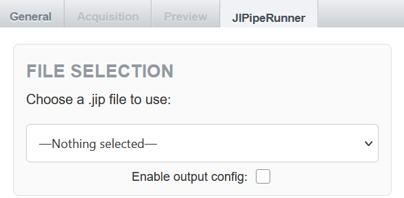
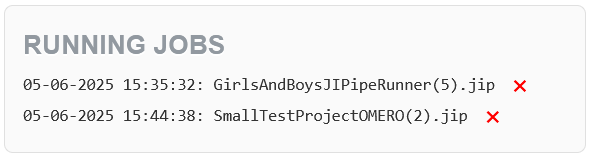
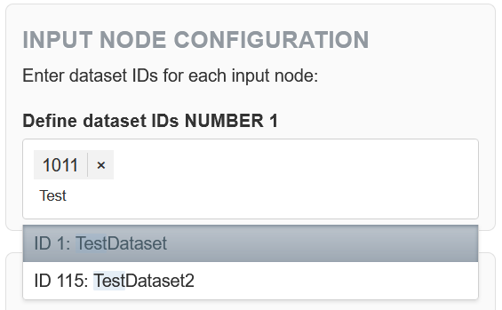
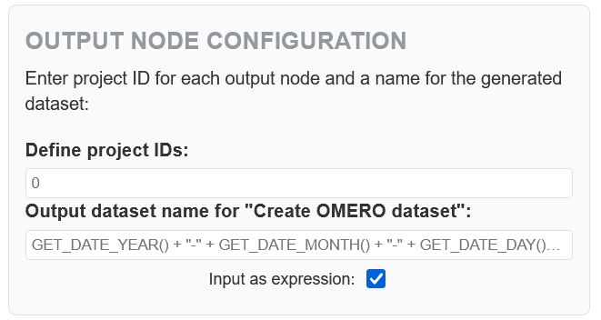
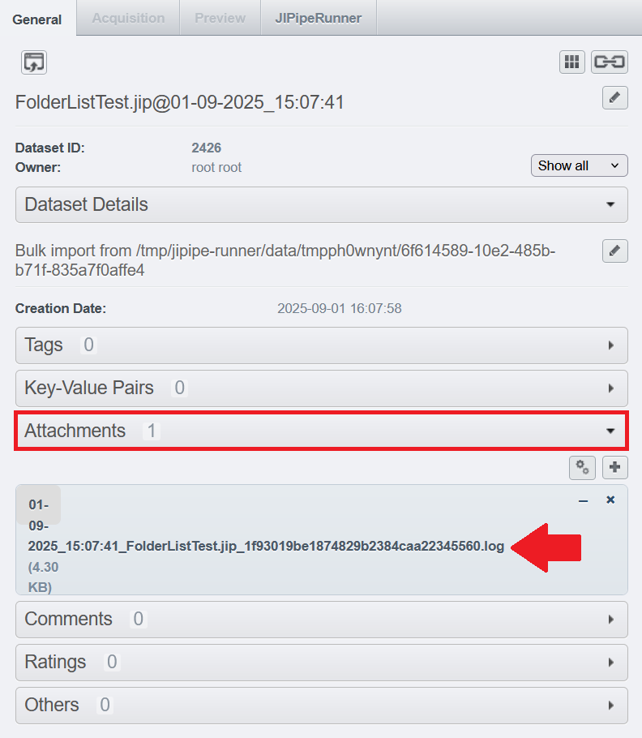
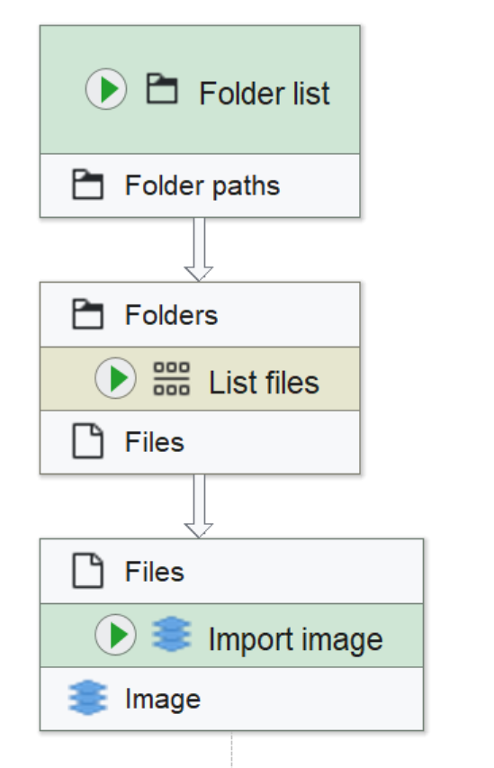
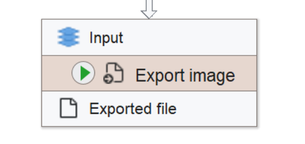

# JIPipeRunner documentation

JIPipeRunner is a plugin for [omero-web](https://github.com/ome/omero-web) that makes it possible to run [JIPipe](https://jipipe.hki-jena.de/) workflows directly on the server that is hosting the OMERO database. This eliminates the need for users to share their data and workflows outside of OMERO and greatly reduces the data traffic as well as aiding reproducibility.

## Features

Frontend-features include:

- Dynamic single page application
- Smooth OMERO integration
- Job management section
- Configurable I/O
- Error resistant UI design using TomSelect
- Customizable JIPipe tooltips
- Live log streaming and log archiving

Backend features include:

- Celery task queue
- Redis distributed caching
- Job status tracking
- Directory management with automated cleanup
- CSRF protection
- JIPipe docker containers

## Requirements

- Python 3.10
- omero-web
- Django
- Docker
- Celery 
- redis

## Installation

This plugin assumes that [omero-web](https://github.com/ome/omero-web) has been setup as described in its [documentation](https://omero.readthedocs.io/en/stable/sysadmins/unix/install-web/web-deployment). To ease the installation process of the plugin, a bash script is provided in the repository. For manual installation, check the [guide for manual installation](ManualInstallationGuide.md).

### Step 1 - Install docker
Docker is required for the plugin to run. So be sure to install it according to the [docker documentation](https://docs.docker.com/engine/install/) before starting the installation process.

Additionally, the omero-web user needs to be part of the docker group. You can test this by running:
```bash
groups omero-web
```

If docker is missing, add it by running:
```bash
sudo usermod -aG docker omero-web
```

and restart to apply:
```bash
sudo systemctl restart omero-web
```

### Step 2 - Clone the repository
Clone the repository and navigate to the folder:
```bash
git clone https://asb-git.hki-jena.de/MWank/OMERO_JIPipe_Plugin.git
cd OMERO_JIPipe_Plugin
```

### Step 3 - Setup redis as cache backend
>**You may ignore this step if you have redis already setup as your caching backend**

First, install redis-server and start the service as the root user:
```bash
apt-get install -y redis-server
service redis-server start
```
Then, as the omero-web system user, edit the omero cache config to point to your redis server location:
```bash
omero config set omero.web.caches '{"default": {"BACKEND": "django_redis.cache.RedisCache", "LOCATION": "redis://127.0.0.1:6379/0"}}'
```
>⚠️ **Be sure your omero setup does not depend on other caching methods** ⚠️

### Step 4 - Install JIPipeRunner
Run the bash script as omero-web with sudo privileges or as root:
```bash
sudo bash installJIPipeRunner.sh
```

The script will ask for input if you have deviated from the default setup used in the [official omero-web installation documentation](https://omero.readthedocs.io/en/stable/sysadmins/unix/install-web/web-deployment). It will check if you have followed the installation process correctly, automatically set the remaining omero config, install JIPipeRunner via pip, check if redis is reachable, start a celery background worker and restart omero-web to apply changes if you wish so. 

## Managing celery
Celery is used as a task queue in the plugin. A so called worker must be launched for celery to process started tasks. This is done automatically when using the provided bash script. In case this fails or you have shutdown the worker, just run this in your omero-web environment to start a new one in the background:
```bash
celery -A JIPipePlugin worker --loglevel=info -E --detach
```

Should you wish to terminate the workers associated with the plugin, simply run this in your omero-web environment:
```bash
celery -A JIPipePlugin control shutdown
```

## User guide

After the installation is completed, you can login to your OMERO server. If the installation was successful, you should see a tab called **JIPipeRunner** in the right panel. 

<p align="center">
  
</p>

Below you will find a detailed explanation for all sections displayed within the plugin.

### FILE SELECTION

The plugin will load its content dynamically depending on the .jip file you select at the top of this section. When checking **Enable output config**, the [output node configuration](#output-node-configuration) will be accessible.

<p align="center">
  
</p>

JIPipeRunner will automatically offer you all .jip files as an option that are accessible by your OMERO groups. If you have none available, you can upload files as attachments to any of your projects or datasets. To do so, select a dataset or project and go to <b>General → Attachments</b> in the right panel. Click the <b>+</b> to attach a .jip file. To ensure compatibility, be sure that it adheres to the <a href="#pipeline-design-constraints">pipeline design constraints</a>.

<p align="center">
  
</p>


### RUNNING JOBS

In this section you will find a list of all the JIPipe jobs currently running on the server that were initiated by the current user. They can be identified by the time and date of execution and the name of the associated .jip file. By clicking the red ✖ next to the entry you can terminate the associated job.



### NODE SUMMARY

In this section you will find an overview of the nodes detected in the associated .jip file. This can be used as a debugging tool to see whether the JIPipe pipeline was constructed according to the [pipeline design constraints](#pipeline-design-constraints) and JIPipeRunner therefore automatically detects the right amount of nodes.


### INPUT NODE CONFIGURATION

If the JIPipe pipeline follows the [pipeline design constraints](#pipeline-design-constraints), this section will allow to enter the IDs of the datasets that contain the input images. On clicking the input field, a scrollable dropdown menu will be shown that lists all available datasets according to your OMERO group. You can simply click a listed dataset to add it to the input field. You can also search for a specific dataset by typing its name into the input field. To remove an entry from the input field, click the ✖ next to the ID.



### OUTPUT NODE CONFIGURATION

When checking **Enable output config** in the [file selection](#file-selection), the output configuration becomes available. Here you can choose a pre-existing project (the same way as selecting the input dataset ID) that you want to save the generated output dataset to and give the dataset a custom name. If you don't enter anything (either when not checking **Enable output config** or when you are not changing the placeholders) the outputs of your pipeline will be saved in a project called "JipipeResultsDefault". The images will be saved within that project in a dataset named after the .jip file and the start time of execution (e.g. FolderListTest.jip@01-09-2025_15:07:41). 



### PARAMETER CONFIGURATION

This section contains the input fields of the parameters that are defined as reference parameters within the .jip file. Nodes with a predefined set of valid options will have a dropdown menu to choose from. Other nodes will accept strings, integers or floats as input depending on the node type. When hovering the **?** the plugin will display a tooltip with the description of the respective parameter (if it was set in the [project overview](https://jipipe.hki-jena.de/documentation/project-overview.html)).

Below this section you will find the **Start JIPipeRunner** button to execute the selected .jip file.


### LOG WINDOW

Below the button that starts the pipeline execution, you will find the log window. During execution, the window will livestream the JIPipe logfile. This can be used to check on the current progress of the execution or to debug problems within the workflow. Any additional information will also be displayed here. For example, if an error occurs a helpful message will tell you what went wrong.


The log window will only ever display the content of the log file from the most recent job started by the user. To review old log files or to inspect errors of jobs that ran in the background, you can find the log files under the attachment tab of the output dataset. By clicking on the file, an automated download will be started. 




## Pipeline design constraints

Since OMERO relies on custom objects rather than a standard filesystem, there are certain constraints in the way the plugin can handle file I/O. To ensure that a JIPipe workflow is compatible with the plugin, it needs to adhere to the design constraints given here.

### Input nodes

In the [input node configuration section](#input-node-configuration), JIPipeRunner will allow you to enter the datasets containing the images you want to use as input for the associated node. You can select multiple datasets per node, their combined content will then be used as input. Internally, JIPipeRunner will call the OMERO API to "download" the images to a temporary folder. To access the data, JIPipeRunner requires the pipeline to use the "Folder list" node as a starting point. The path leading to the "downloaded" data will automatically be inserted. This means the input structure should look something like this:

<p align="center">
  
</p>

Only the "Folder list" nodes will be detected as valid input nodes. If you use anything else, the plugin will not allow you to select the input from within OMERO. Technically, only the "Folder list" node is required. However, we recommend the above structure since other image importers like the "Bio-Formats importer" are not functional within the plugin yet.

### Reference parameter configuration

To prevent the display of all possible node parameters of a pipeline within the plugin, the creator of the pipeline must specify the parameters that should be changeable as reference parameters in the [project overview](https://jipipe.hki-jena.de/documentation/project-overview.html) within JIPipe. If none are specified, the [parameter configuration section](#parameter-configuration) will be empty and the pipeline can only be executed with the input specified within the .jip file.


### Output nodes

When executed with an unchecked **Enable output config**, JIPipeRunner will automatically create a new project within the OMERO database called "JipipeResultsDefault" or use a pre-existing project with the same name. Otherwise, the user input in the [output node configuration section](#output-node-configuration) will be used.

For a pipeline to store its results in a dataset within a project, it is crucial that the output that should be stored in OMERO is connected to a "Export image" node: 

<p align="center">
  
</p>

Currently, JIPipeRunner only supports exporting images to OMERO. Exporting other files requires a different OMERO API call. The implementation for that will be a feature for a future version.

>⚠️ **Please note: JIPipeRunner will name the output files using the auto_file_name expression. Currently this requires the output to have atleast one annotation.** ⚠️

## License & Attribution

Marius Wank, Ruman Gerst, Marc Thilo Figge

Research Group Applied Systems Biology - Head: Prof. Dr. Marc Thilo Figge\
https://www.leibniz-hki.de/en/applied-systems-biology.html \
HKI-Center for Systems Biology of Infection\
Leibniz Institute for Natural Product Research and Infection Biology - Hans Knöll Institute (HKI)\
Adolf-Reichwein-Straße 23, 07745 Jena, Germany

This plugin is licensed under the **Creative Commons Attribution 4.0 International License (CC BY 4.0)**.  
You are free to share and adapt it with proper attribution.  
See: [CC BY 4.0 License](https://creativecommons.org/licenses/by/4.0/)

### Dependencies & Third-Party Tools

- **Tom Select** (UI select widget)  
  Licensed under the [Apache License 2.0](http://www.apache.org/licenses/LICENSE-2.0)


This plugin is designed to work with **JIPipe**, developed by **Ruman Gerst and Zoltán Csereynes**.  
> JIPipe is **not** included in this plugin’s distribution. Please visit [jipipe.org](https://jipipe.org) for license details.