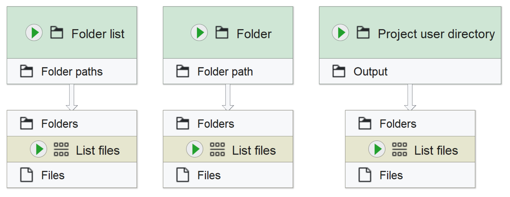

# Preparing JIPipe workflows

J2O imposes some constraints on the design of JIPipe workflows to ensure compatability with the plugin. In this section you will learn what to be aware of. 

If your workflow does not comply to these constraints yet, it is quite easy to make the necessary changes.

## Create user directories

J2O utilizes JIPipe user directories to facilitate saving processed data to OMERO and using OMERO image data as input for custom scripts or expression nodes. 

> To create user directories, navigate to the project overview and click the "Directories" button and select "Add new directory".

### Output directories

To store processed data back to OMERO you will need to create at least one output user directory. To mark a directory as output, include "output" in the key you set for the directory. These output directories will then need to be used in the [export nodes](#export-nodes).

> Output directories are used to store both image and non-image data to OMERO

### Input directories

To use OMERO image data as input in custom scripts and JIPipe expression nodes, you need at least one input directory. To mark a directory as input, include "input" in the key you set for the directory.

> Input directories can only be used to get image data from OMERO! For importing non-image data use RO-Crates, available since JIPipe 6.0.0

## Input nodes

### Image input
To use your OMERO image data as input for workflows executed with J2O, your workflows need to use one of the following input nodes.

> The "Project user directory" node can be used by entering the key of an input user directory in its parameter config 
### Non-image input
Using non-image inputs in your workflows is only supported when your workflow is exported in a RO-Crate, a feature introduced in JIPipe 6.0.0. 

## Export nodes

## Reference parameters